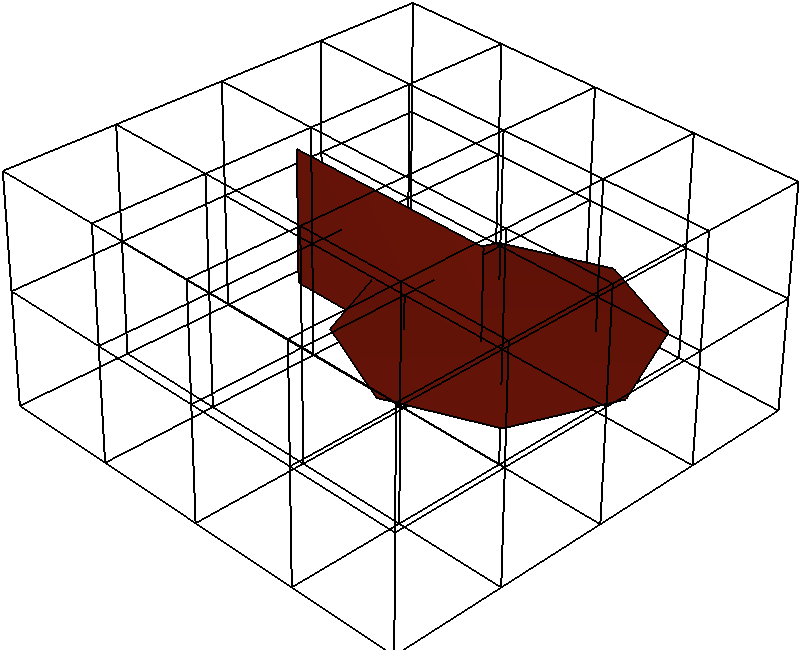
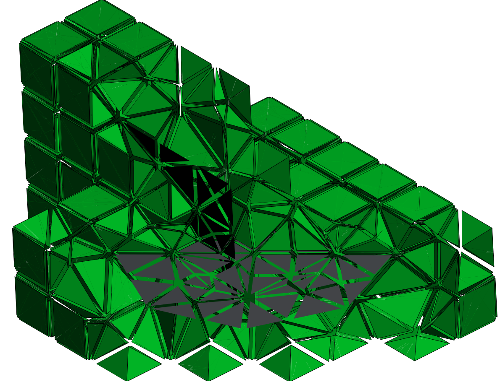
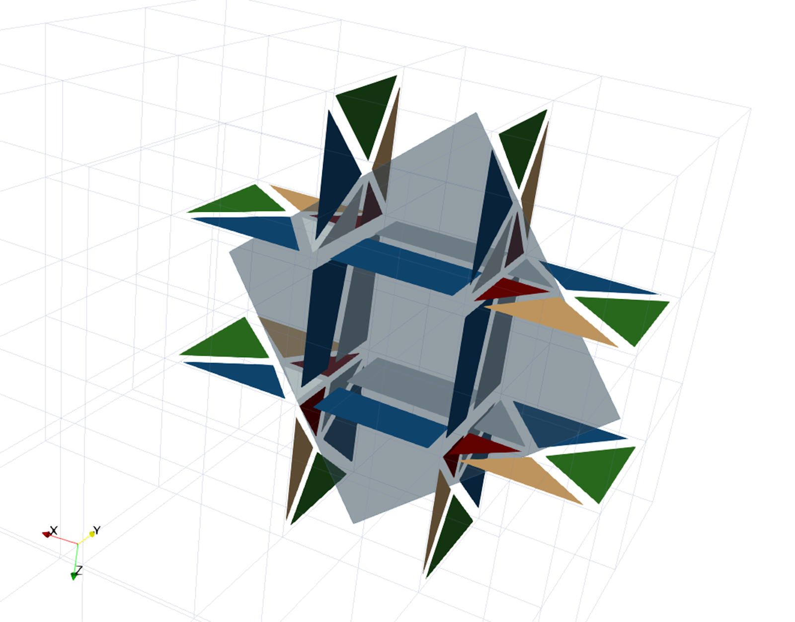

 
 <h1> DFNMesh </h1>

The main goal of this project is to provide an intersection searching-and-processing tool that is able to insert polygons into a tridimensional coarse mesh and refine it to conform to these polygons. Ultimately describing a fractured medium, as a two-level discretisation mesh, for Discrete Fracture Network (DFN) flow simulation methods available in <a href="https://github.com/labmec/neopz">NeoPZ</a>.
 

 

## Dependencies
This project is highly dependent in 2 open source libs:
### [NeoPZ](https://github.com/labmec/neopz "NeoPZ repository")
### [GMsh](https://gitlab.onelab.info/gmsh/gmsh "GMsh repository")

(see <code>main()</code> in each branch for its assumed version of each library)

## Cool graphics

